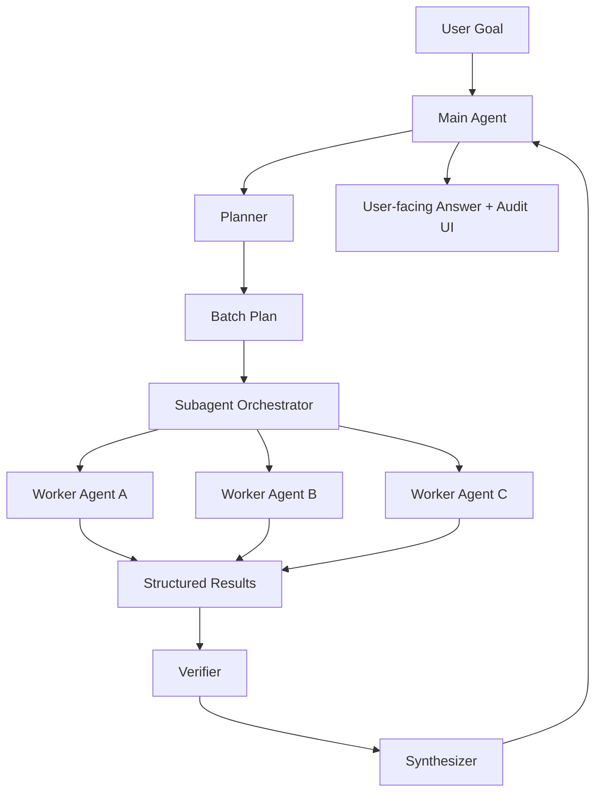

# RFC-7: Multi-Agent Final Architecture

> **状态**：Draft
> **创建**：2026-06-04
> **目标**：把当前 `delegate_subagents` MVP 升级为可恢复、可重试、可审计、可权限隔离的多子 agent 协同系统。
> **前置**：[RFC-6: Multi-Subagent Collaboration](./2026-06-03-rfc-6-multi-subagent-collaboration.md)
> **预计工期**：MVP+ 10-14 人天；独立 worker + 工程型 subagent 另计 12-18 人天。

---

## 0. TL;DR

当前多 subagent 已完成核心 MVP：

- 主 agent 可以调用 `delegate_subagents`。
- Orchestrator 可以并发创建 child agent。
- 子结果可以展开显示。
- child session 可以挂到 parent session 下。
- child agent 运行结束后释放运行态，只保留 session 文件用于审计。

但这仍然是“并行工具调用”形态，不是完整的“多 agent 协同系统”。终态应该升级为：

```text
User Goal
  -> Planner 拆解任务与角色
  -> Orchestrator 创建 batch / task / child runtime
  -> Workers 并行执行
  -> Verifier 检查冲突、遗漏、证据质量
  -> Synthesizer 生成最终答案
  -> UI 支持展开、重试、恢复、继续追问、导出审计
```

核心原则：

1. **子 agent 是工作单元，不是普通聊天 session。**
2. **运行态可释放，历史态可恢复。**
3. **失败只重试失败的子任务，不重跑整个 batch。**
4. **写操作必须隔离，默认只读。**
5. **主 agent 不再同时承担规划、执行、总结、验证四个角色。**

---

## 1. 现状与问题

### 1.1 当前已具备

| 能力 | 状态 |
|---|---|
| `delegate_subagents` custom tool | 已完成 |
| 并发 child `AgentSession` | 已完成 |
| child 禁止递归 subagent | 已完成 |
| child 默认隐藏运行态 | 已完成 |
| child session 挂 parent session | 已完成 |
| subagent 结果可展开 | 已完成 |
| task 完成后释放 child runtime | 已完成 |

### 1.2 当前缺口

| 缺口 | 影响 |
|---|---|
| child 不能继续追问 | 好结果无法继续深挖 |
| 单 task 不能 retry | 一个失败会污染整体体验 |
| 缺少 planner | 任务拆分完全依赖模型即时判断 |
| 缺少 verifier | 多 agent 结果冲突无法发现 |
| 缺少审计模型 | 运行过程、工具次数、成本、证据质量不可系统查看 |
| 权限隔离不足 | implementation subagent 暂时不能安全放开 |
| 没有独立 worker | 长任务、崩溃隔离、资源限制还不够稳 |

---

## 2. 产品终态

### 2.1 用户视角

用户提出复杂任务后，系统应该表现为：

1. 主 agent 先识别是否需要多 agent。
2. 如果任务复杂，主 agent 生成一个可读的协作计划。
3. 用户可以看到每个子 agent 的任务、角色、状态、结果。
4. 某个子 agent 失败时，可以只重试它。
5. 某个子 agent 回答有价值时，可以继续追问它。
6. 最终答案不是简单拼接，而是经过验证、去重、冲突标注后的综合。

### 2.2 典型场景

| 场景 | 多 agent 价值 |
|---|---|
| 批量制度问答 | 每个问题一个 RAG worker，结果可审计 |
| 代码审查 | 按模块拆分 reviewer，最终合并风险 |
| 调研对比 | 每个竞品一个 research worker，verifier 检查口径 |
| 工程实现 | planner 分配 read-only review / implementation / test worker |
| 长文档分析 | 按章节拆分 worker，synthesizer 统一观点 |

---

## 3. 目标与非目标

### 3.1 目标

**G1：多阶段协同。**

从单一 `delegate_subagents` 工具升级为 `plan -> execute -> verify -> synthesize` 的可观察工作流。

**G2：子 agent 可恢复。**

child runtime 完成后释放，但用户可以基于 child `sessionFile` 重新 resume，继续追问。

**G3：单任务可重试。**

失败、超时、低质量结果可以按 task retry，不影响已完成 task。

**G4：可审计。**

每个 batch/task 都有状态、耗时、模型、token、成本、工具次数、sessionFile、错误原因。

**G5：权限隔离。**

默认 read-only；implementation subagent 必须绑定写入边界，避免并行写冲突。

**G6：可扩展到独立进程。**

同进程 MVP 不废弃，但接口设计必须能平滑迁移到 worker process。

### 3.2 非目标

- 不做无限多 agent 自主繁殖。
- 不允许 child agent 默认再创建 grandchild agent。
- 不把每个 child 都变成 sidebar 顶层普通会话。
- 不在没有隔离策略前允许多个 implementation agent 同时写同一文件。
- 不要求每个任务都多 agent，简单任务仍由主 agent 单独完成。

---

## 4. 总体架构

### 4.1 终态架构图



### 4.2 运行态与历史态

```text
Runtime state:
  AgentRecord
  BatchController
  SSE listeners
  AbortController
  active tool subscriptions

Persistent state:
  parent session jsonl
  child session jsonl
  batch metadata
  task metadata
  result details
```

运行态结束后可以释放；历史态必须保留，以便：

- 展开结果
- 导出审计
- retry
- resume child
- 重建 sidebar parent-child 关系

---

## 5. 核心模块设计

### 5.1 Planner

Planner 负责判断是否需要多 agent，并生成 batch plan。

输入：

```ts
interface PlanningInput {
  userGoal: string;
  cwd: string;
  availableTools: string[];
  modelId: string;
  budget?: { maxTasks?: number; maxCostUsd?: number; maxWallTimeMs?: number };
}
```

输出：

```ts
interface SubagentPlan {
  reason: string;
  confidence: number;
  mode: "single-agent" | "multi-agent";
  tasks: PlannedSubagentTask[];
  synthesisInstructions?: string;
  verifierInstructions?: string;
}
```

Planner 可以分两阶段做：

| 阶段 | 实现 |
|---|---|
| Phase 1 | 规则式 planner：问题数量、列表结构、关键词触发 |
| Phase 2 | LLM planner：生成结构化 JSON plan |

### 5.2 Orchestrator

Orchestrator 负责 batch 生命周期：

```text
created
  -> planned
  -> running
  -> verifying
  -> synthesizing
  -> completed

or:
  -> aborted / failed / timeout
```

职责：

- 创建 batch
- 控制并发
- 创建 child runtime
- 监听 child events
- 收集结果
- 触发 verifier/synthesizer
- 处理 abort/retry/resume

### 5.3 Worker Agent

Worker 是子 agent，默认只处理一个 task。

默认约束：

- `enableSubagents: false`
- `hidden: true`
- `parentSessionPath` 指向 parent
- read-only tools by default
- task prompt 必须 self-contained
- 输出结构固定：结论、依据、限制、可复核信息

### 5.4 Verifier

Verifier 不负责回答用户，而负责检查 worker 结果：

- 是否有遗漏任务
- 是否有互相矛盾
- 是否缺少依据
- 是否有明显 hallucination
- 是否存在失败/超时需要重试

输出：

```ts
interface VerificationReport {
  status: "passed" | "warning" | "failed";
  missingTaskIds: string[];
  conflicts: Array<{
    taskIds: string[];
    summary: string;
    severity: "low" | "medium" | "high";
  }>;
  retryRecommendations: Array<{
    taskId: string;
    reason: string;
  }>;
}
```

### 5.5 Synthesizer

Synthesizer 基于 worker results + verifier report 生成最终答案。

它必须：

- 不无脑拼接
- 标注不确定性
- 对冲突给出解释
- 保留用户需要的结构
- 必要时引用 task id 或来源

---

## 6. 数据模型

### 6.1 Batch

```ts
interface SubagentBatch {
  id: string;
  parentAgentId: string;
  parentSessionPath?: string;
  status:
    | "planned"
    | "running"
    | "verifying"
    | "synthesizing"
    | "completed"
    | "failed"
    | "aborted";
  reason: string;
  tasks: SubagentTaskRuntime[];
  verification?: VerificationReport;
  synthesis?: {
    answer: string;
    messageEntryId?: string;
  };
  createdAt: number;
  endedAt?: number;
}
```

### 6.2 Task

```ts
interface SubagentTaskRuntime {
  id: string;
  title: string;
  prompt: string;
  role: SubagentRole;
  status: "pending" | "running" | "completed" | "failed" | "aborted" | "timeout";
  permissions: SubagentPermissionProfile;
  agentId?: string;
  sessionFile?: string;
  answer?: string;
  answerPreview?: string;
  error?: string;
  startedAt?: number;
  endedAt?: number;
  usage?: {
    turns?: number;
    costUsd?: number;
    inputTokens?: number;
    outputTokens?: number;
    toolCalls?: number;
  };
}
```

### 6.3 Permission Profile

```ts
interface SubagentPermissionProfile {
  mode: "read-only" | "browser" | "write-scoped" | "full-with-approval";
  allowedTools: string[];
  writablePaths?: string[];
  deniedTools?: string[];
  requiresApproval?: boolean;
}
```

---

## 7. API 设计

### 7.1 查询 batch

```http
GET /api/agent/:id/subagents
GET /api/agent/:id/subagents/:batchId
```

用途：

- 页面刷新后恢复 batch 状态
- sidebar 展示子 agent 关系
- 审计面板读取结果

### 7.2 Abort

```http
POST /api/agent/:id/subagents/:batchId/abort
POST /api/agent/:id/subagents/:batchId/tasks/:taskId/abort
```

### 7.3 Retry

```http
POST /api/agent/:id/subagents/:batchId/tasks/:taskId/retry
```

行为：

- 复用原 task prompt/role/permissions
- 创建新的 child runtime
- 结果写入 task revision
- UI 显示 retry 历史

### 7.4 Resume Child

```http
POST /api/sessions/:childSessionId/resume-agent
```

行为：

- 基于 child sessionFile 创建新的 AgentRecord
- 保留 parentSessionPath
- 可在 child 会话中继续追问
- 结束后继续释放 runtime

---

## 8. 事件协议

```ts
type SubagentEvent =
  | { type: "subagent_plan_created"; batch: SubagentBatch }
  | { type: "subagent_batch_start"; batch: SubagentBatch }
  | { type: "subagent_task_start"; batchId: string; taskId: string; agentId: string }
  | { type: "subagent_task_update"; batchId: string; taskId: string; answerPreview?: string }
  | { type: "subagent_task_end"; batchId: string; taskId: string; result: SubagentResult }
  | { type: "subagent_verification_start"; batchId: string }
  | { type: "subagent_verification_end"; batchId: string; report: VerificationReport }
  | { type: "subagent_synthesis_start"; batchId: string }
  | { type: "subagent_synthesis_end"; batchId: string; answer: string }
  | { type: "subagent_batch_end"; batchId: string; status: SubagentBatchStatus };
```

---

## 9. UI 设计

### 9.1 Chat 中的 batch card

必须支持：

- 展开/收起每个 subagent
- 显示状态、role、title
- 显示 answer markdown
- 显示 session file
- 显示耗时、turns、token/cost
- 显示 retry 按钮
- 显示 continue 按钮
- 显示 verifier warnings

### 9.2 Sidebar

规则：

- parent session 顶层展示
- child session 默认折叠
- parent 行显示 `N subagents`
- 选中 child 时自动展开 parent
- child 不能抢占普通会话优先级

### 9.3 Audit 面板

后续可以增加独立 audit panel：

```text
Batch #abc
  Planner
  Workers
    Q1 completed 8s $0.001
    Q2 failed timeout
  Verifier
    conflict: Q3 vs Q7
  Synthesizer
    final answer entry
```

---

## 10. 生命周期策略

### 10.1 Child Runtime

```text
create child runtime
  -> subscribe events
  -> prompt
  -> collect answer
  -> emit result
  -> unsubscribe
  -> dispose runtime
  -> keep session file
```

原则：

- runtime 是短生命周期资源
- session file 是长期审计记录
- retry/resume 通过 session file 重新创建 runtime

### 10.2 Batch Store

Phase 1 使用 global memory store。

Phase 2 落盘：

```text
~/.shaula/subagents/
  batches/
    {batchId}.json
```

落盘后页面刷新、服务重启仍可恢复 batch 审计。

---

## 11. 权限隔离

### 11.1 默认只读

所有 worker 默认：

```ts
allowedTools = ["read", "grep", "find", "ls"];
```

### 11.2 写入型 subagent

写入型必须满足：

- 显式 role = `implementation`
- 明确 `writablePaths`
- 同一 batch 内 writablePaths 不重叠
- 写前先产出 patch plan
- 主 agent 或用户审批后才写

### 11.3 并行写冲突检测

Orchestrator 在创建 implementation workers 前检查：

```text
worker A writablePaths intersects worker B writablePaths
  -> reject plan
  -> ask planner to serialize tasks
```

---

## 12. 阶段路线

### Phase A: 生命周期与审计补全

目标：让当前 MVP 更稳。

- child runtime 完成后 dispose
- batch/task 补 usage/toolCalls/duration
- sidebar parent-child 默认折叠
- batch card 支持 retry/continue 的 UI 占位
- batch metadata 落盘

### Phase B: Retry + Resume

目标：让子 agent 成为可复用工作单元。

- retry single task
- retry failed tasks
- resume child session
- task revision history
- UI 展示 retry 历史

### Phase C: Planner + Verifier

目标：从“主 agent 即时委派”升级到“可解释协作计划”。

- 规则式 planner
- LLM planner JSON schema
- verifier agent
- final synthesis 阶段化
- 冲突/遗漏/低置信度标注

### Phase D: Permission Isolation

目标：支持工程型多 agent。

- read-only / write-scoped permission profile
- writable path conflict detection
- implementation subagent patch plan
- approval integration
- per-task budget and timeout

### Phase E: Independent Worker Process

目标：把 child runtime 从同进程升级到可隔离 worker。

- worker process protocol
- event bridge
- worker pool
- crash recovery
- resource limit
- background long-running batch

---

## 13. 验收标准

### 13.1 MVP+ 验收

- 31 个问题可拆成 31 个子任务。
- UI 默认只展开第一个，其他可展开。
- child session 在 sidebar 折叠到 parent 下。
- child 完成后 runtime 被释放。
- 刷新页面后仍能看到 batch 结果。

### 13.2 Retry 验收

- 单个失败 task 可以 retry。
- retry 不影响已完成 task。
- retry 后 verifier/synthesizer 可以重新运行。

### 13.3 Resume 验收

- 用户可以从某个 child result 点击继续追问。
- resume 后仍保留 parent-child 关系。
- resume runtime 结束后继续释放。

### 13.4 Verifier 验收

- 两个 worker 输出冲突时，最终答案能标注冲突。
- 缺少依据时，verifier 能打 warning。
- failed/timeout task 不会被 synthesis 静默吞掉。

---

## 14. 风险与对策

| 风险 | 对策 |
|---|---|
| 多 agent 过度触发 | Planner 加阈值，简单任务走 single-agent |
| 成本失控 | per-batch/per-task budget |
| UI 被 child 刷屏 | sidebar 折叠，chat batch card 折叠 |
| 结果冲突 | verifier 阶段 |
| child runtime 泄漏 | finally dispose + tests |
| 并行写冲突 | write-scoped permission + path intersection |
| 服务重启丢审计 | batch metadata 落盘 |

---

## 15. 推荐下一步

建议接下来的实现顺序：

1. **Batch metadata 落盘**
2. **单 task retry**
3. **resume child session**
4. **audit 信息补全**
5. **verifier agent**
6. **permission profile**
7. **independent worker process**

原因：

- retry/resume 是用户最容易感知的价值。
- metadata 落盘是 retry/resume 的基础。
- verifier 是多 agent 真正走向“协同”而不是“并发”的关键。
- implementation subagent 必须等权限隔离成熟后再放开。

